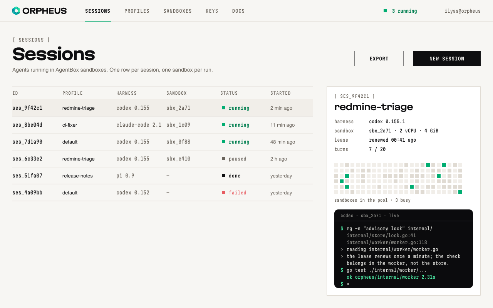

# Orpheus interface

How the web UI looks. The sessions screen in `interface/` follows these rules:

<picture>
  <source media="(prefers-color-scheme: dark)" srcset="interface/sessions-dark.png">
  
</picture>

References: agentbox.ru and e2b.dev. Near-black and off-white, one accent, mono
captions, sharp corners, 1 px lines, dot matrices.

## Principles

- One accent. Everything else is ink, paper and greys; colour means state.
- Sharp. No rounded corners, except console windows.
- Lines, not shadows. Surfaces are separated by 1 px rules and `bg-raised`.
- Type does the styling: display face for titles, mono for data, system sans
  for reading.
- Both themes, always. Every screen is designed in light and dark; tokens
  switch, the layout does not.

## Type

Fonts are in `fonts/`; body text uses the system sans and loads nothing.

| Role | Face | Size | Notes |
|---|---|---|---|
| Page title | Martian Grotesk SemiExpanded ExtraBold | 40 px | tracking −0.035 em |
| Panel title | Martian Grotesk SemiExpanded Bold | 22 px | tracking −0.025 em |
| Section caption | Martian Mono Condensed | 12 px | uppercase, in brackets: `[ SESSIONS ]`, tracking 0.08 em |
| Navigation, buttons | Martian Mono Condensed | 12 px | uppercase, tracking 0.08 em; active item SemiBold |
| Table header | Martian Mono Condensed | 11 px | uppercase, `muted` |
| Data: ids, versions, times | Martian Mono Condensed | 13 px | |
| Names, descriptions | system sans | 13–14 px | |
| Body copy | system sans | 16 px | line height 1.6 |

## Layout

- Page gutter 32 px, content up to 1280 px, 8 px rhythm.
- Header 56 px: logo 22 px tall, mono navigation, status and account on the
  right, 1 px rule below. The active item has a 2 px accent underline.
- Page order: caption → title → one-line description → content.
- Tables: header row, 44 px rows, 1 px rules, selected row on `bg-subtle`,
  no zebra stripes.
- Panels: `bg-raised` with a 1 px `line` border, 20 px padding.
- Buttons: 40 px tall, square. Primary is `ink` with `bg` text; secondary is
  a 1 px `ink` border.

## Components

- Status: an 8 px square in the state colour before a mono label; `running` is
  SemiBold in `accent-ink`.
- Console: `term-bg`, radius 10 px, a 30 px title bar with a mono caption
  (`codex · sbx_2a71 · live`), no traffic lights. Prompts in `term-ok`,
  output in `term-fg`, paths in `term-dim`.
- Matrix: 10 px squares on a 14 px pitch; `bg-subtle` empty, `line` idle,
  `accent` busy. For pools and activity at a glance, not for exact numbers.
- Dither: Bayer fields for hero areas and empty states, as on agentbox.ru;
  ink or accent on `bg` at low density.

## Logo in the interface

- Header: `logo/orpheus-logo.svg` on dark, `orpheus-logo-light.svg` on light,
  22–24 px tall.
- Narrow screens: the mark alone, 24 px.
- Favicon and app icons: `web/`.
- The mark is never recoloured. The mono logo is for one-colour contexts, not
  for the app header.

## Don't

- No pill-shaped chips: tags are square, or plain text with a marker.
- No fake browser chrome with three dots.
- No monospace for body copy.
- No gradients in the UI; the mark is the only one.
- No third colour: errors use `danger`, everything else is ink, greys and the
  accent.
